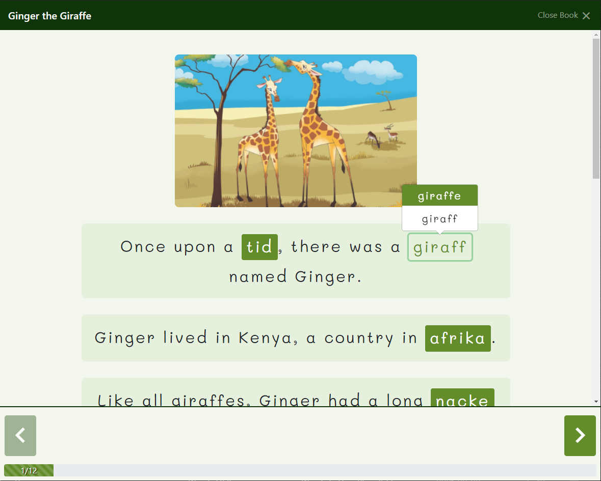
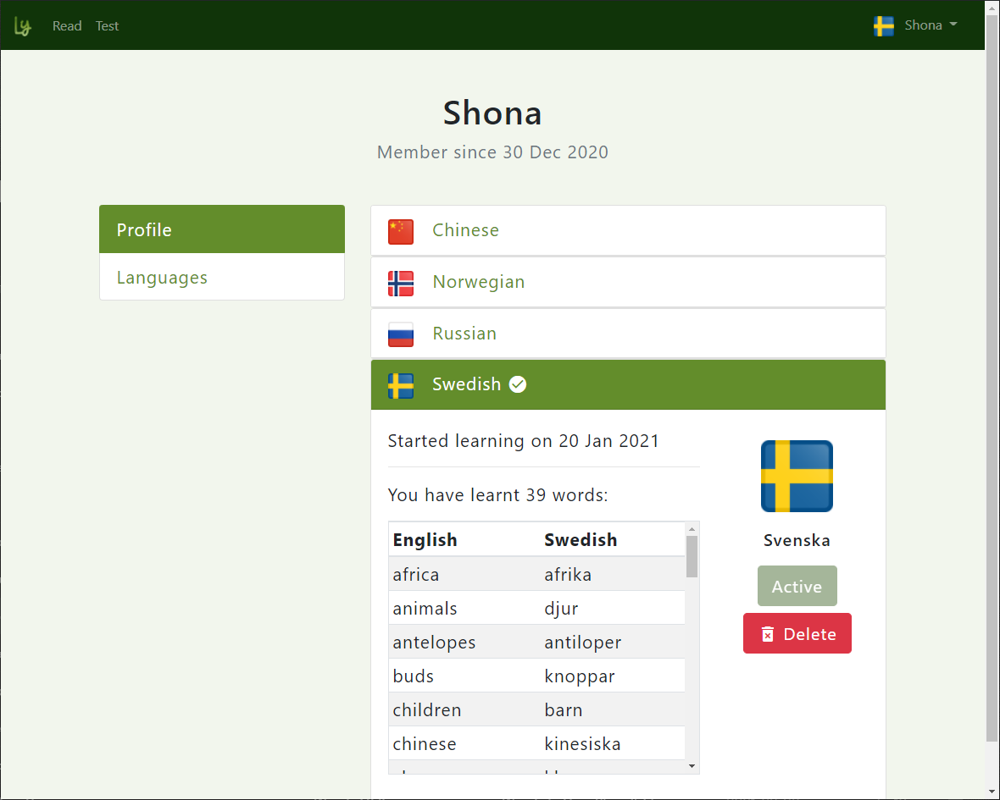
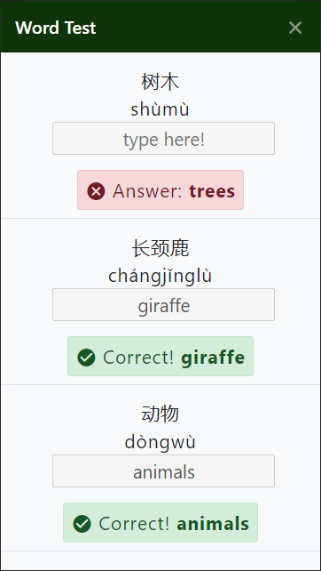

# Langy

<h1 align="center">
  
</h1>

 

    Langy is a reading-focused foreign language learning aid orientated towards young children.

    Reading is an activity that every child knows. It is a necessary skill that is learned at school and at home, not only building on a child’s linguistic capability but also their cognitive and social skills.

    Langy aims to enable children to learn a new language in a manner that feels familiar to them. The platform allows users to read a variety of children’s books. Some words in the text are translated into the user's learning language - a foreign language of choice - which are indicated and can be selected to show the English translation.

 
<h1>Read</h1>

    The application is optimised for both desktop and mobile use.

    

    

 
<h1>Profile</h1>

    Progress with language learning is tracked and visible on user profiles.

    

 
<h1>Word Test</h1>

    Users can test their translation skills on words they have previously interacted with while reading.

    

